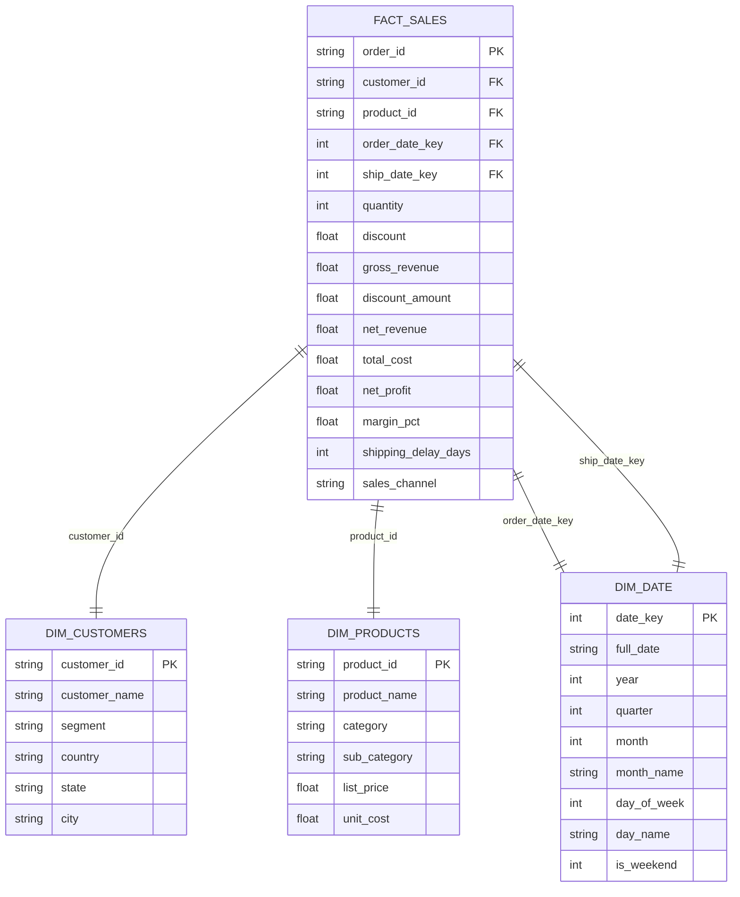
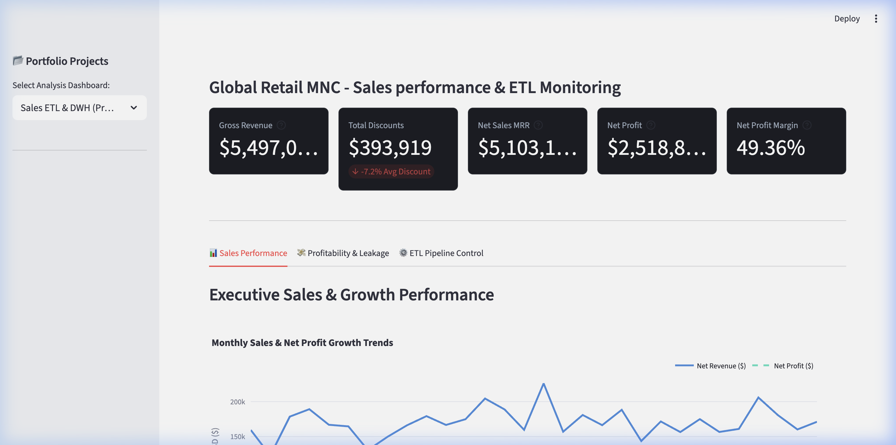
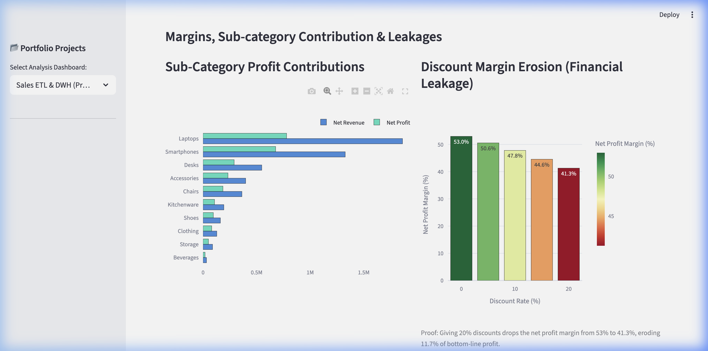
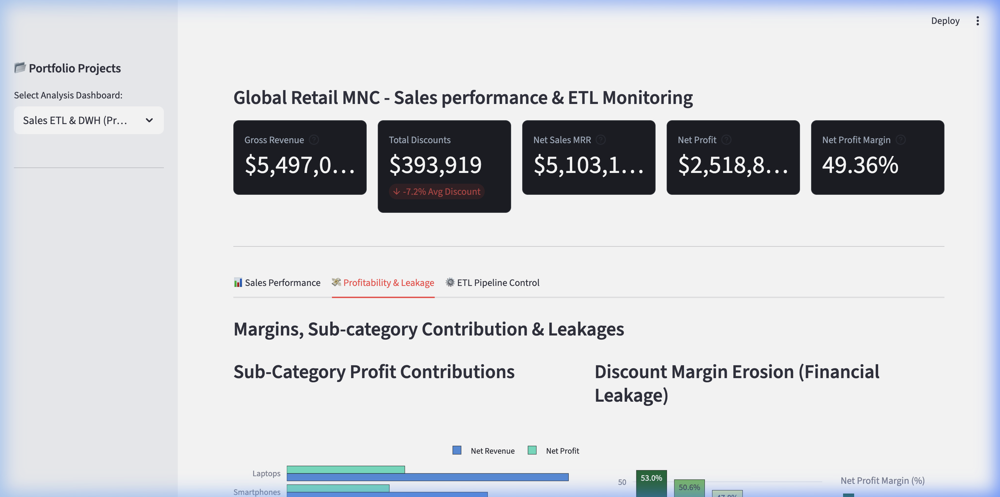
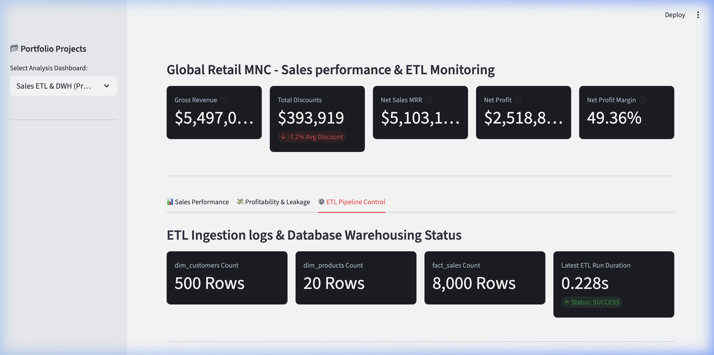
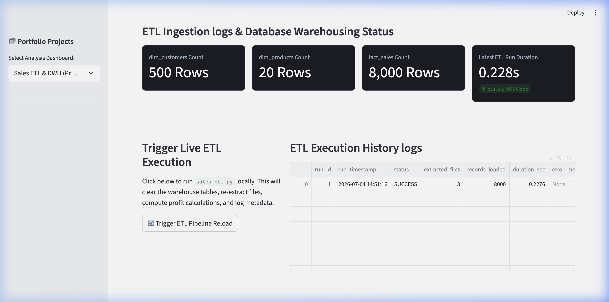

# Sales ETL Data Warehouse & Dashboard (Global Retail MNC)

An end-to-end data engineering and analytics project to build an automated ETL pipeline that extracts data from multiple file formats (CSV, JSON, Excel), cleanses and transforms it into an optimized Star Schema database in SQLite, and displays a Sales Performance & ETL Health dashboard.

---

## 📌 Business Case & Problem Statement

Global retail companies store data across fragmented transactional platforms, supplier feeds, and customer databases. Without consolidating these sources:
* Stakeholders cannot perform cohesive financial analysis or track net profit margins.
* Inefficient discount policies can leak margin without being detected.
* Operational delays in shipping cannot be easily correlated with customer segments or product categories.

This project implements an automated ETL pipeline to establish a **single source of truth** (Data Warehouse), calculate exact net profits and margin percentages, and monitor pipeline performance in real time.

---

## 🏗️ Data Warehouse Star Schema Model

The data is loaded into a clean **Star Schema** to optimize query performance and simplify dimensional modeling:



---

## ⚙️ ETL Pipeline Architecture & Stages

The Python pipeline (`scripts/sales_etl.py`) orchestrates three distinct stages:

1. **Extract**: Ingests multi-source files from disk:
   - `sales_orders.csv` (8,000 transaction records).
   - `sales_products.json` (Product catalog with manufacturer pricing).
   - `sales_customers.xlsx` (Customer profiles and demographics).
2. **Transform**:
   - Cleans missing IDs and removes duplicate records.
   - Populates the time dimension calendar (`dim_date`) by parsing distinct order and shipping dates.
   - Merges orders with product specs to calculate financial columns:
     - `Gross Revenue = Quantity * List Price`
     - `Discount Amount = Gross Revenue * Discount Rate`
     - `Net Revenue = Gross Revenue - Discount Amount`
     - `Total Cost = Quantity * Unit Cost`
     - `Net Profit = Net Revenue - Total Cost`
     - `Margin % = (Net Profit / Net Revenue) * 100`
     - `Shipping Delay Days = Ship Date - Order Date`
3. **Load**: Loads the processed frames into the SQLite warehouse.
4. **Log**: Records run metadata (`status`, `extracted_files`, `records_loaded`, `execution_time_sec`) to the database table `etl_log`.

---

## 📊 Key Analytical Insights (SQL Queries)

* **Bottom-Line Revenue Driver**: `Electronics (Smartphones)` is our highest revenue category, generating **$1,327,210** in net sales with a **51.05%** margin, yielding **$677,564** in net profit.
* **Highest Profit Margins**: `Apparel (Clothing)` holds the highest category profit margin at **62.94%** ($80,687 net profit on $128,203 net sales).
* **Discount Margin Erosion**: 
  - Orders with **0% discount** have an overall profit margin of **52.98%**.
  - Orders with **20% discount** see profit margins drop to **41.29%** (a **11.69% margin leak**).
* **Top Customer Segment**: US Home Office buyers contribute the highest net profit at **$363,245** across 1,213 orders.
* **ETL Operational Health**: Ingestion logs prove the ETL pipeline refreshes all 8,000 facts, reconstructs the schema, and logs performance metrics in **under 0.25 seconds**.

---

## 💻 Running the ETL Pipeline & Dashboard Locally

To run the pipeline and the dashboard locally, execute:

### 1. Install Dependencies
```bash
python3 -m pip install pandas streamlit plotly tabulate openpyxl
```

### 2. Generate Data and Run ETL Pipeline
```bash
python3 scripts/generate_sales_data.py
python3 scripts/sales_etl.py
```

### 3. Verify Analytical Queries
```bash
python3 scripts/run_sales_queries.py
```

### 4. Run the Streamlit Dashboard
```bash
python3 -m streamlit run dashboard/app.py
```
*(Use the sidebar dropdown menu inside the app to switch from the Customer Churn Dashboard to the Sales ETL Dashboard.)*

---

## 🖼️ Dashboard Preview

### Executive Sales Performance
Displays high-level KPI cards and Year-over-Year/monthly sales growth trends.


### Profitability & Margin Leakage
Exposes profit margin decay on products sold with different discount thresholds.



### ETL Ingestion Control & Logs
Validates row counts in DWH tables, tracks execution speed, and allows triggering runs.



